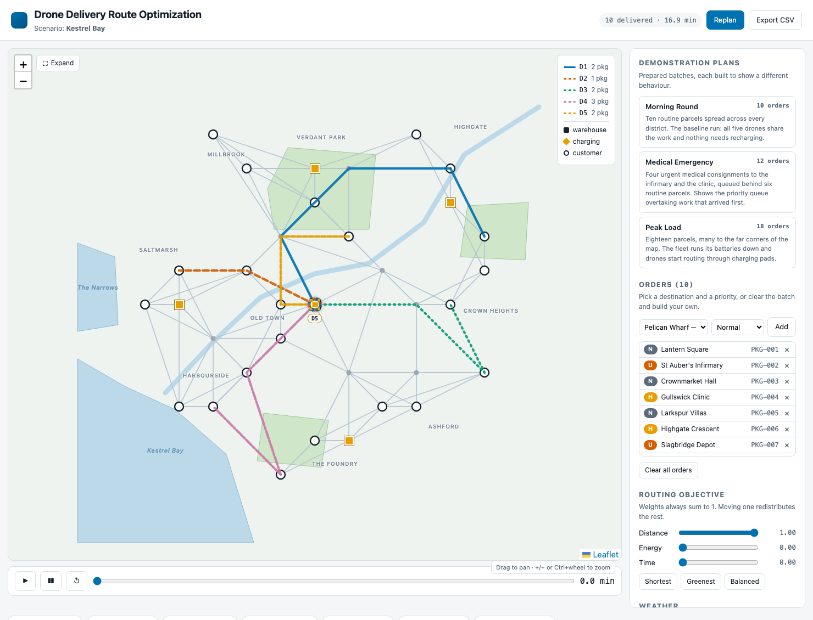
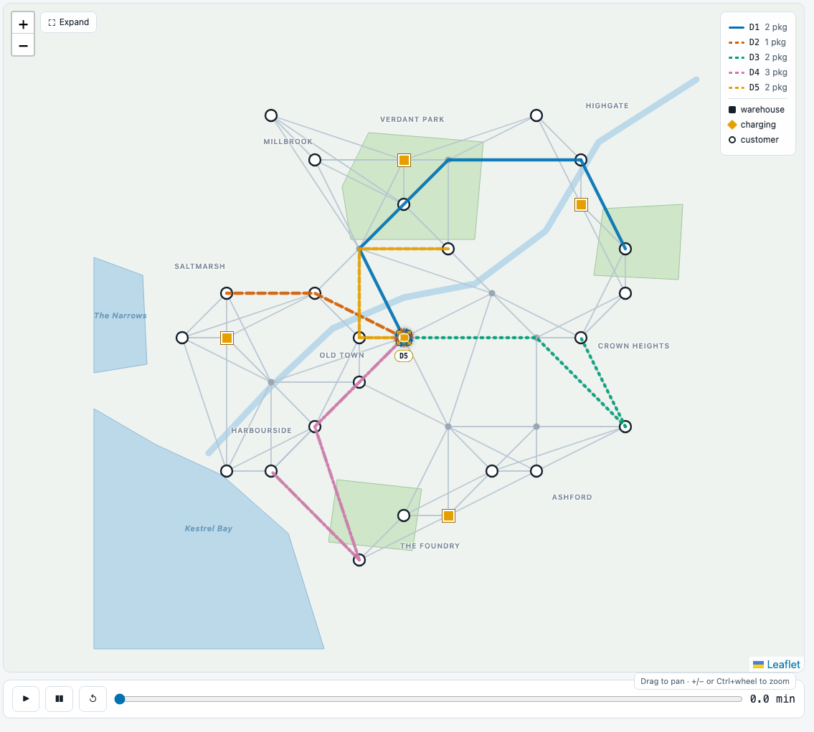
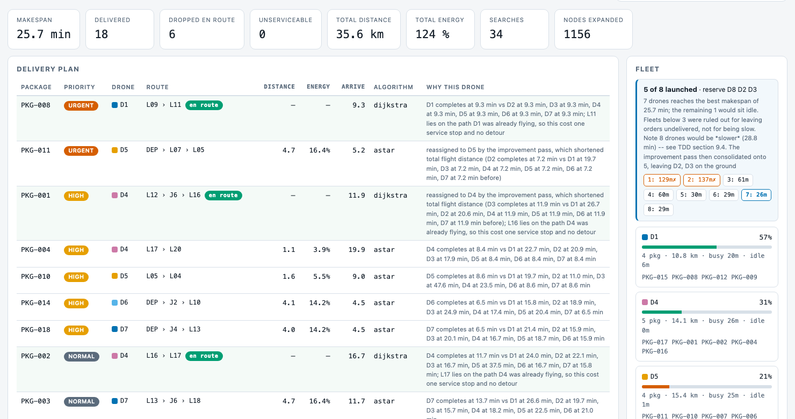
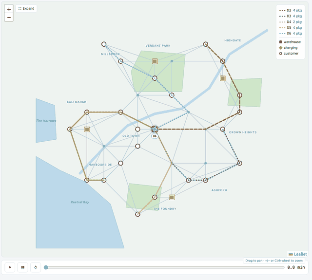
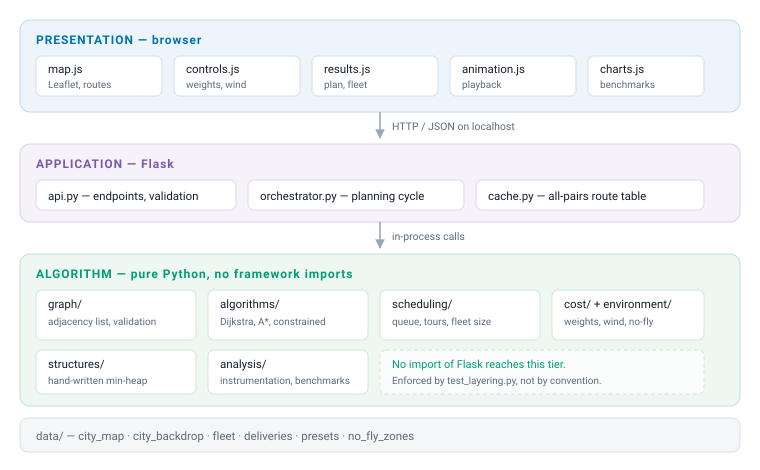
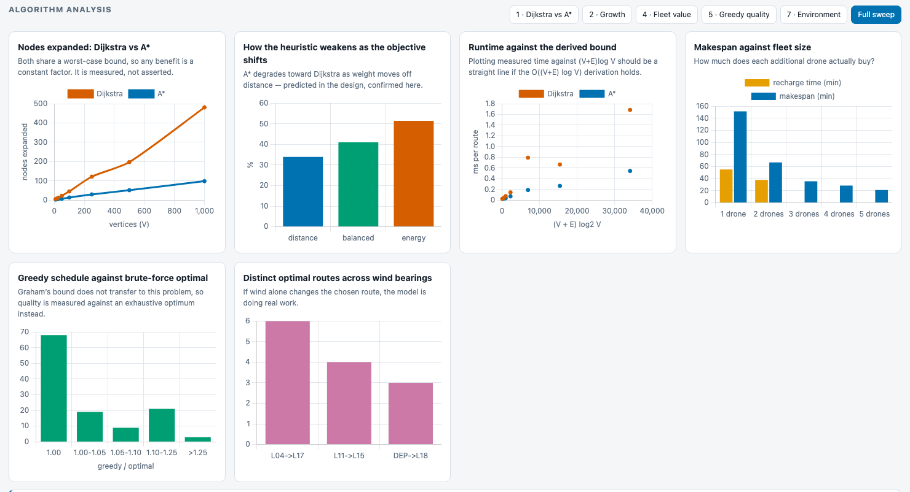

# Drone Delivery Route Optimization System

A simulation that plans, prioritizes and assigns unmanned package deliveries across
**Kestrel Bay**, a fictional coastal city of 34 named locations served by a roster of eight
drones — of which it decides how many to actually launch.



It automates four decisions a human dispatcher would otherwise make by hand:

| | Decision | How |
|---|---|---|
| 1 | Which delivery goes next | Priority queue over a hand-written binary min-heap |
| 2 | Which drone takes it | Greedy assignment, then a local-search improvement pass |
| 3 | Which route it flies | Dijkstra or A* over a weighted graph, under a configurable cost |
| 4 | Whether the route is feasible | Energy budget, with rerouting through charging pads |

No single algorithm solves the problem. A graph models the city, a priority queue orders the
work, Dijkstra and A* find routes, and greedy strategies pick the drone — each handling a
different part of the whole.

---

## Quick start

```bash
pip install -r requirements.txt
python run.py serve          # dashboard at http://127.0.0.1:5000
```

```bash
python run.py plan                             plan the batch and print the schedule
python run.py plan --beta 0.6                  weight the objective toward energy
python run.py plan --wind 12 --bearing 250     plan under a westerly wind
python run.py plan --nfz nfz_aerodrome         close an airspace
python run.py plan --drones 3                  force a fleet size
python run.py plan --consolidate always        take every parcel found en route
python run.py compare DEP L16                  Dijkstra against A* on one pair
python run.py queue                            show the dispatch order
python run.py benchmark                        run all seven experiments
```

---

## Kestrel Bay



The city is invented, so there is no base map to tile: its bay, river, parks and nine named
districts are drawn from local data, which leaves the application with **no network
dependency at run time**. 34 locations — one depot, four charging pads, 22 customers and
seven junctions — joined by 92 air corridors.

Each drone gets one colour **and** one dash pattern, so routes stay distinguishable under
colour-vision deficiency and on a projector.

### Demonstration plans

| Plan | What it shows |
|---|---|
| **Morning Round** | The baseline. Ten routine parcels, work shared across the fleet, no recharging. |
| **Medical Emergency** | Four urgent consignments submitted *behind* six routine ones — the priority queue overtaking work that arrived first. |
| **Peak Load** | Eighteen parcels to the far corners. Batteries run down and drones route through charging pads. |

You can also clear the batch and build your own, choosing each destination by name and
district and setting its priority.

---

## The delivery plan



Every row explains itself. *Why this drone* names the alternatives and their completion
times; an **en route** badge marks a stop that cost no detour, with a dash for distance and
energy because it added none. The fleet panel shows which aircraft were launched, which were
held in reserve, and what every fleet size would have achieved.

Playback flies the fleet on a shared clock: each drone is drawn as a quadcopter turned to its
heading, rotors spinning only while airborne, releasing a parcel over each destination.



*Peak Load — eighteen parcels, five drones, 20.2 minutes of simulated flight. Each drone works
one sector of the city; the ring marks a parcel released.*

A moment in a run can be deep-linked for sharing or capture:
`?plan=peak_load&t=9.1` loads that batch and parks the clock at 9.1 minutes.

---

## Algorithms and data structures

| Problem | Technique | Where |
|---|---|---|
| Represent the city | Weighted graph, adjacency list | `graph/graph.py` |
| Order the frontier and the queue | Binary min-heap, written from scratch | `structures/min_heap.py` |
| Minimum-cost route | Dijkstra's algorithm | `algorithms/dijkstra.py` |
| Goal-directed route | A* with an admissible haversine heuristic | `algorithms/astar.py` |
| Prioritize deliveries | Priority queue, FIFO within a class | `scheduling/priority_queue.py` |
| Assign work | Greedy list scheduling for minimum makespan | `scheduling/assignment.py` |
| Improve the schedule | Relocate + 2-opt local search | `scheduling/assignment.py` |
| Choose the fleet size | Exhaustive sweep with a tolerance | `scheduling/fleet_sizing.py` |
| Energy-feasible routing | Two-search charging reroute; exact Pareto variant | `algorithms/constrained.py` |

Dijkstra, A*, the min-heap and the greedy strategies are implemented from first principles
rather than imported, since they are the subject of the project. `heapq` appears only in the
test suite, as an oracle to cross-check the hand-written heap.

The A* heuristic is **proved** admissible and consistent in TDD §7.3, and both properties are
asserted by tests across every weight and wind combination. Every planning cycle re-checks
that A* and Dijkstra agree on cost, so an inadmissible heuristic fails loudly rather than
silently returning sub-optimal routes.

---

## Architecture



The algorithm tier imports nothing from the web tier, so it can be tested and benchmarked
without starting a server. `test_layering.py` enforces this rather than trusting it.

---

## Experiments

The harness measures every complexity claim the design makes rather than asserting it.
Reproduce with `python run.py benchmark`.

The analysis panel runs the sweep in the browser and charts the results:



*`?benchmark=all` runs the full sweep on load, which is how this was captured.*

| # | Question | Result |
|---|---|---|
| 1 | Does A* actually search less than Dijkstra? | Yes, increasingly so with scale: **52% → 22%** of Dijkstra's expansions from V=10 to V=1000. |
| 2 | Does runtime match the derived `O((V+E) log V)`? | **R² above 0.99** on an idle machine. Being a timing measurement it moves with load. |
| 3 | Does energy-aware routing save energy? | Per journey yes; **per batch no** when the fleet is near its battery limit. |
| 4 | What does each extra drone buy? | Superlinear speedup. Makespan is **not monotone in general**, though the improvement pass removes the anomaly from this scenario. |
| 5 | How good is the schedule? | **4.7% above optimal** on average, and optimal outright in 56.7% of instances. Greedy alone was 23% above; the improvement pass closed most of the gap. |
| 6 | Is the fast feasibility test safe? | Conservative, never unsafe — but exact search costs only 1.2× more at this scale. |
| 7 | Do wind and no-fly zones change decisions? | **381 of 561** node pairs are wind-sensitive. |

### Findings that contradicted the hypothesis

Three experiments disproved their own starting assumption. They are reported as observed, not
corrected away — the contradiction is the result worth reading.

- **Graham's timing anomaly reproduces here.** Adding a drone can *lengthen* the schedule.
  A control run with identical batteries and zero charging detours shows it survives, so the
  cause is sequence-dependent travel inside the greedy assignment, not battery state. This is
  why the system chooses its fleet size rather than launching everything.
- **Energy-optimal routing can raise total batch energy**, because slower routes delay drones
  into charging detours that cost more than the per-route saving recovers.
- **The fast feasibility test is conservative, not unsafe** — every disagreement was a false
  refusal, never a false promise — but timed fairly, the exact method costs only 1.2× more,
  so the approximation is justified by scale rather than by this scenario.

### Balanced rounds, no wasteful fly-overs

An earlier version let a drone fly straight over a pending destination while a second drone
was dispatched to that same place — and gave one drone far more parcels than the rest, its
stops scattered right across the city.

Each drone's plan is now a **tour**. Planning starts from two constructions — greedy by
earliest completion, and a polar sweep that hands each drone a wedge of the city — and keeps
whichever polishes better under a local search of relocate and 2-opt moves, applied both
between tours and within one.

A move is accepted when it shortens the flying without delaying the finish, or shortens the
finish for at most 2% more flying. Balance follows from that rather than from a quota on
parcels per drone: the makespan *is* the busiest drone, so relieving it comes first.

| Peak Load, 5 drones | Distance | Makespan | Parcels per drone | Widest tour |
|---|---|---|---|---|
| Before | 56.8 km | 25.7 min | — | 135° |
| After | **28.7 km** | **20.2 min** | **4 / 4 / 4 / 4 / 2** | **59°** |

The guarantee is that **when planning finishes, no move would improve it**. Verified across
**2,016 planning runs**: every demonstration plan, batches of 20–40 orders with distinct and
repeated destinations, six wind vectors, four routing weightings, fleet sizes 2–8, and every
no-fly-zone combination. All converged.

---

## Tests

```bash
python -m pytest tests -q
python -m pytest tests -q --cov=ddros
```

**276 tests, 94% statement coverage.** Unit, property, integration, contract and architectural
tests, including admissibility and consistency proofs checked numerically, a determinism
check, and a convergence audit of the improvement pass under wind.

---

## Layout

```
ddros/
  geo.py            haversine, bearing, projection, polygon geometry
  graph/            adjacency-list city graph and its validation
  structures/       hand-written binary min-heap
  cost/             composite distance/energy/time cost model
  environment/      wind field and no-fly zones
  algorithms/       Dijkstra, A*, heuristics, energy-constrained routing
  scheduling/       priority queue, tours, improvement pass, fleet sizing
  simulation/       planning orchestrator, all-pairs route cache
  analysis/         search instrumentation and benchmarking
  web/              Flask API and the Leaflet dashboard
data/               city map and backdrop, fleet, batch, demo plans, no-fly zones
tests/              unit, property, integration, contract and architectural tests
docs/               SRS, technical design document, images
```

---

## Documentation

| Document | Contents |
|---|---|
| [Software Requirements Specification](docs/SRS.md) | IEEE 830-1998. What the system must do, as numbered and traceable requirements. |
| [Technical Design Document](docs/TDD.md) | Architecture, cost mathematics, algorithm pseudocode and complexity, and the observed results of all seven experiments. |
